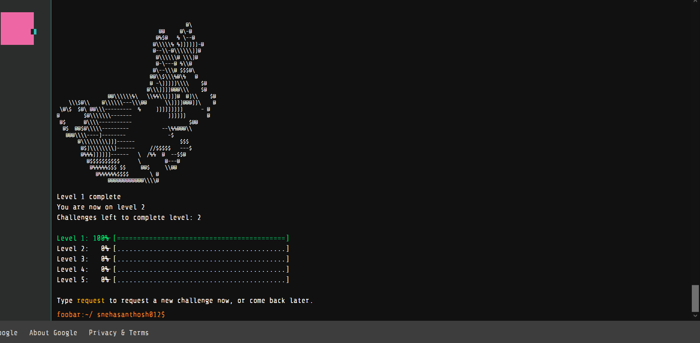

# GoogleFoobarChallenge
Questions and answers for Google's secret foo.bar challenge I received.

Google has a secret challenge for coders who do a lot of google searches related to coding. When I was searching for arraylist in java I saw an unusual message pop up saying "Curious developers are known to seek interesting problems. Solve one from google?". So I decided to give it a try. 

So far I have completed level 1 of the challenge using Java, which I have uploaded here.

Here's my level 1 bunny hopping around after I solved the problem.

